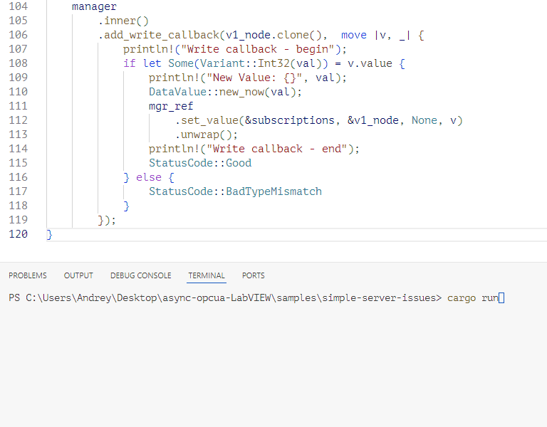
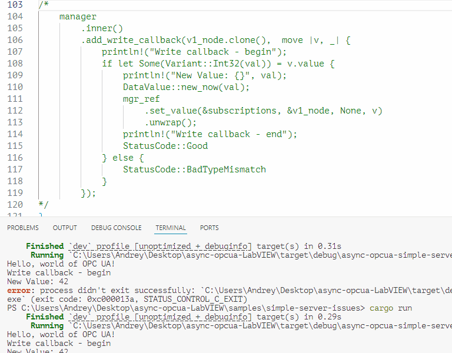

## Two Issues demo

This example is based on original `simple-server` (the only v1 variable and write callback was added).

### First Issue

The problem with code below:

```rust
    manager
        .inner()
        .add_write_callback(v1_node.clone(),  move |v, _| {
            if let Some(Variant::Int32(val)) = v.value {
                println!("New Value: {}", val);
                mgr_ref // Issue is write lock in .set_value:
                    .set_value(&subscriptions, &v1_node, None, v)
                    .unwrap();
                println!("Write callback - end");
                StatusCode::Good
            } else {
                StatusCode::BadTypeMismatch
            }
        });
```

The problem is that when v1 gets changed (using UA Expert as an OPC UA Client, for example), the callback is triggered (as expected), but it stays in .set_value(). As a result, UA Expert freezes, and then a Timeout is raised.

More specifically, this occurs here at x.write():

```rust
/// Tracing macro for obtaining a write lock on a `RwLock`.
#[macro_export]
macro_rules! trace_write_lock {
    ( $x:expr ) => {
        {
//            use std::thread;
//            trace!("Thread {:?}, {} write locking at {}, line {}",...
            let v = $x.write(); // << lock here
//            trace!("Thread {:?}, {} write lock completed",...
            v
        }
    }
}
```

Screen recording:



If I will unlock address_space, then .set_value will work, but this is not normal  and unsafe way:

```rust
    address_space.force_unlock_write();
    manager
    	.set_value(&subscriptions, &v1_node, None, DataValue::new_now(42))
    	.unwrap();
```

## Second Issue

If I will remove write callback completely, then attempt to write variable caused BadNotWritable Error in UA Expert:



Take a note, that the variable was created as writable:

```rust
    let sample_folder_id = NodeId::new(ns, "folder");
    address_spacel.add_folder(
        &sample_folder_id,
        "Sample",
        "Sample",
        &NodeId::objects_folder_id(),
    );

    VariableBuilder::new(&v1_node, "v1", "v1")
        .data_type(DataTypeId::Int32)
        .value(1)
        .writable() // << Writable!
        .organized_by(&sample_folder_id)
        .insert(&mut *address_spacel);
```

